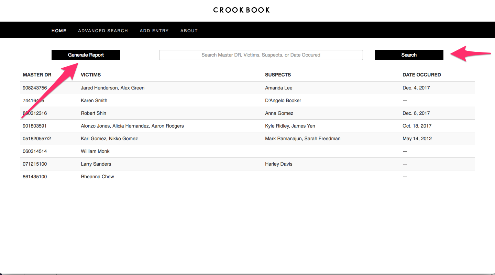
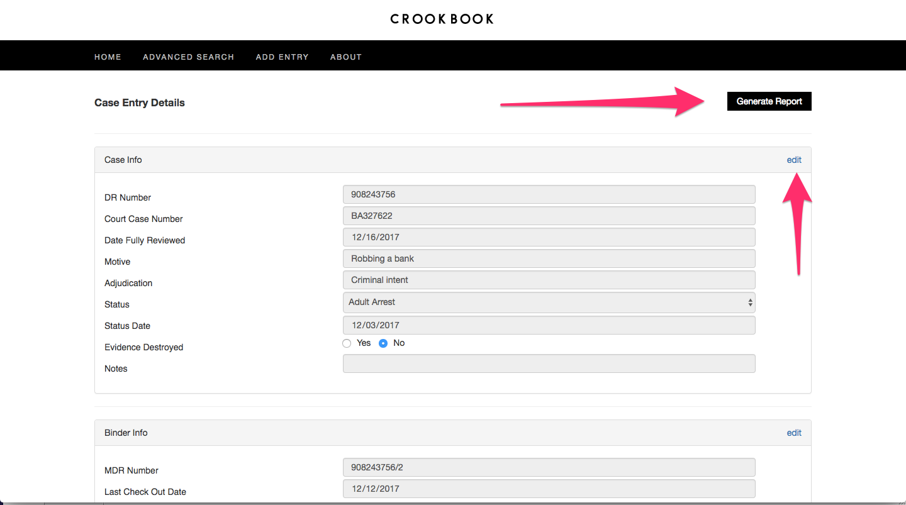
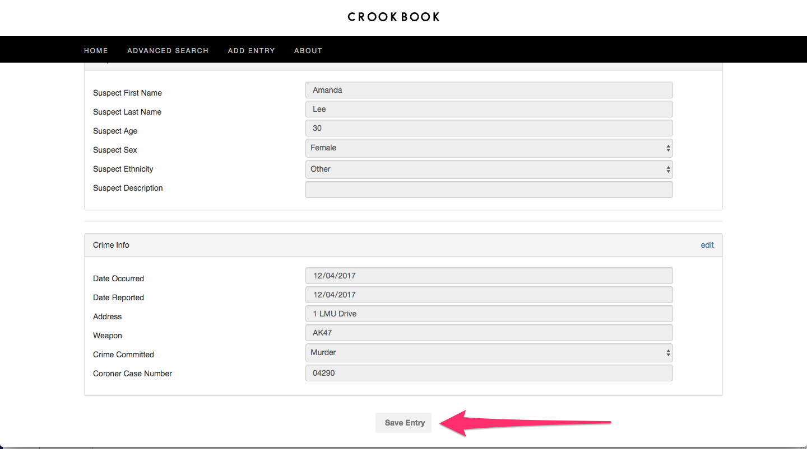
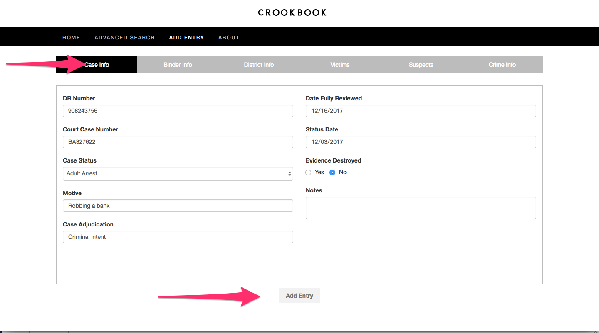

# User Manual
This manual will show how to use all the features presented within the CrookBook application.

## CrookBook Home Page
The CrookBook Home page displays all murder cases that are compiled within the CrookBook database, as well as a search bar to easily search for cases in the database, and a generate report button to generate a PDF document of all homepage cases or searched cases. Located horizontally along the top of the CrookBook application is a black features bar that contains tabs pertaining to all of CrookBook's features: the Home page, Advanced Search, Add Entry, and About page. In order to return to the Home page, click on the tab that says "Home" on the top left in the Features bar or click the CrookBook logo located at the top center of the page.

## Case Entry Details
A case's Entry Details page can be accessed by clicking on the case in the Home page, Advanced Search page, or right after you add a new entry to the CrookBook database. The Case Entry Details page contains a list of every attribute of the case. There is also a Generate Report button located at the top right of the page that will generate a PDF document including all the case information.

To see all the attributes of a case see the Add Entry section of this manual. All of these attributes can be edited by clicking the edit button located at the top right of the corresponding section in which the attribute is located. Example: Click on the Edit button in the top right of the Case Info section to edit case information like case notes. Once all edits have been made, you need to click on the Save Entry button located at the bottom of the page to save any edits made to the case.

## Features Bar
The Features bar contains tabs that link to all of CrookBook's functionalities. The Features bar is a black horizontal bar located at the top of the page. It contains the Home, Advanced Search, Add Entry and About tabs which link to their respective functionalities by clicking on them within the Features bar.

## Advanced Search

## Add Entry
The Add Entry function of CrookBook allows you to add a new murder case entry to the CrookBook database. There are five different aspects of a case, each with their own fill out forms. Once all the necessary forms have been filled you can press the Add Entry button located bottom center of the page to add the Entry to the CrookBook database.

### Case Info Form
The Case Info form contains information pertaining to just the case file itself. This includes: DR Number, Date Fully Reviewed, Court Case Number, Status Date, Case Status, Evidence Destroyed, Motive, Notes, Case Adjudication. The DR Number is a required field of the Case Info Form in order for the Entry to be added to the CrookBook database.
### Binder Info Form
The Binder Info Form contains information based on which binder the case is located. The fields are: Master DR and Check Out Date. The Master DR field is required in order for the Entry to be added to the CrookBook database.
### District Info Form
The District Info Form contains information pertaining to the District of law enforcement that is working on the case. The fields are: Division, Bureau and Reporting District. The Division field is required in order for the Entry to be added to the CrookBook database.
### Victims Form
The Victims Form allows you to add the proper amount of victims associated with a case. You will then be prompted with a Victims Form page with the following fields: First Name, Last Name, Age, Sex, Ethnicity, Description.
### Suspects Form
The Suspects Form allows you to add the proper amount of suspects associated with a case. You will then be prompted with a Suspects Form page with the following fields: First Name, Last Name, Age, Sex, Ethnicity, Description.
### Crime Info Form
The Crime Info Form contains information pertaining to the specifics of the crime itself.
The fields are: Coroner Case Number, Weapon, Crime Address, Crime Committed, Date Reported, Date Occurred.

## About Page
The About Page contains this user manual for any future reference.
